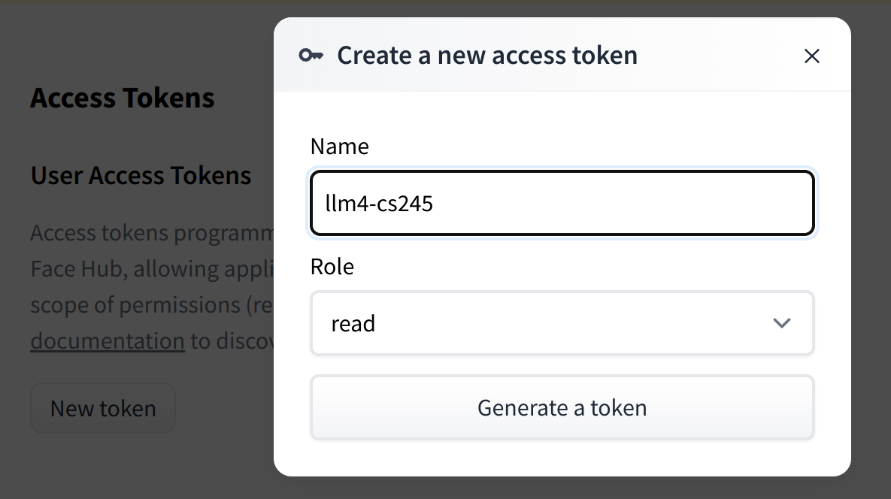

# CS245 Project for LLM4

Members:
* Zhenghao Peng (105951555)
*
*


## Getting started


### Setup conda environment

```bash
# Create conda environment:
conda create -n llm4 python=3.11

# Activate conda environment:
conda activate llm4
```

### Install dependencies

Install Pytorch first:
```bash
pip install torch

# To address the compatibility issue for running Pytorch
# with different GPU, we suggest to install Pytorch by
# carefully selected a compatible version: 
# https://pytorch.org/get-started/locally/
```

Install Hugging Face related packages:
```bash
pip install transformers accelerate datasets


# Login your hugging face account:
huggingface-cli login
```

> [!NOTE]
> You might need to create a [hugging face](https://huggingface.co/) account and [generate](https://huggingface.co/settings/tokens) a read token:
> 


### Install this repo itself


Our project modifies the code from https://github.com/EleutherAI/lm-evaluation-harness
To install this repo, please use:
```bash
cd cs245-llm4/

pip install -e .
```

## The first evaluation! Evaluate baseline model on MMLU

By running the following script, we:
1. download the LLaMA-2 model, 
2. download the MMLU datasets and 
3. evaluate the LLaMA-2-7b model in the MMLU dataset

```bash
cd cs245-llm/

lm-eval \
--model hf \
--model_args pretrained=meta-llama/Llama-2-7b-chat-hf,dtype=float16 \
--tasks mmlu \
--device cuda:0
```


## FAQ


### How to access the LLama2 model in Hugging Face?

1. Get approval from Meta.
2. Get approval from HF.
3. Create a read token from here : https://huggingface.co/settings/tokens
4. `pip install transformers`.
5. execute `huggingface-cli login` and provide the read token.
6. Execute your code. It should work fine.